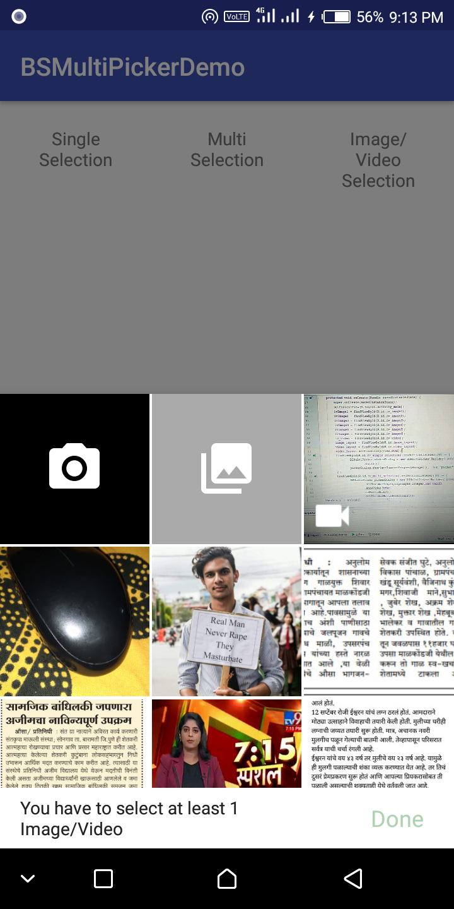
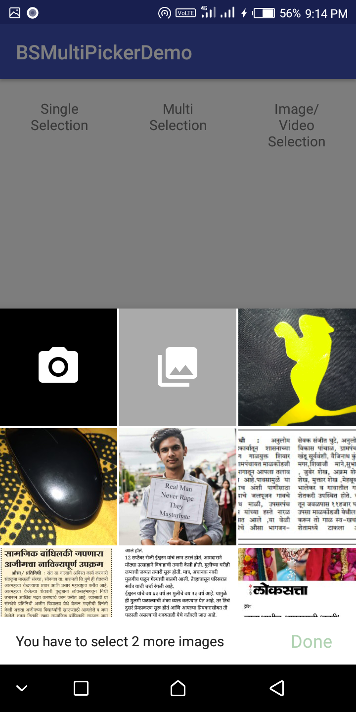
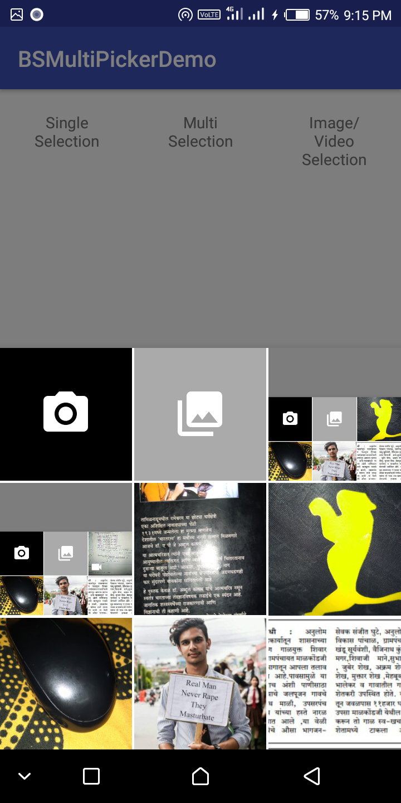

## BSMultiPicker (Android Multipicker Library Images, Videos)
Forked from BSImagePicker, but added some features.like image/Video Picker 


<p>
&nbsp;&nbsp;&nbsp;&nbsp;
&nbsp;&nbsp;&nbsp;&nbsp;

</p>

The design of this library is referenced from [BSImagePicker](https://github.com/siralam/BSImagePicker).

But `BSImagePicker` does not allow selection from camera and gallery when in multi selection mode, which is possible in this BSMultiPicker with video select also.

The below code snippet also shows all configurables, with some description.  

Single Selection with image and video:

```java
       BSMultiPicker singleSelectionPicker = new BSMultiPicker.Builder("com.yourdomain.yourpackage.fileprovider")
               .setMaximumDisplayingImages(24) //Default: Integer.MAX_VALUE. Don't worry about performance :)
               .showVideo(true) //for select video also Default only image picker shoe Default: false
               .setSpanCount(3) //Default: 3. This is the number of columns
               .setGridSpacing(Utils.dp2px(2)) //Default: 2dp. Remember to pass in a value in pixel.
               .setPeekHeight(Utils.dp2px(360)) //Default: 360dp. This is the initial height of the dialog.
               .build();
```

Single Selection with only image:

```java
       BSMultiPicker singleSelectionPicker = new BSMultiPicker.Builder("com.yourdomain.yourpackage.fileprovider")
               .setMaximumDisplayingImages(24) //Default: Integer.MAX_VALUE. Don't worry about performance :)
               .showVideo(false) //for select video also Default only image picker shoe Default: false
               .setSpanCount(3) //Default: 3. This is the number of columns
               .setGridSpacing(Utils.dp2px(2)) //Default: 2dp. Remember to pass in a value in pixel.
               .setPeekHeight(Utils.dp2px(360)) //Default: 360dp. This is the initial height of the dialog.
               .build();
```

Multiple Selection with image and video:

```java
       BSMultiPicker multiSelectionPicker = new BSMultiPicker.Builder("com.yourdomain.yourpackage.fileprovider")
               .isMultiSelect() //Set this if you want to use multi selection mode.
               .showVideo(true) //for select video also Default only image picker shoe Default: false
               .setMinimumMultiSelectCount(2) //Default: 1.
               .setMaximumMultiSelectCount(10) //Default: Integer.MAX_VALUE (i.e. User can select as many images as he/she wants)
               .setMultiSelectBarBgColor(android.R.color.white) //Default: #FFFFFF. You can also set it to a translucent color.
               .setMultiSelectTextColor(R.color.primary_text) //Default: #212121(Dark grey). This is the message in the multi-select bottom bar.
               .setMultiSelectDoneTextColor(R.color.colorAccent) //Default: #388e3c(Green). This is the color of the "Done" TextView.
               .setOverSelectTextColor(R.color.error_text) //Default: #b71c1c. This is the color of the message shown when user tries to select more than maximum select count.
               .disableOverSelectionMessage() //You can also decide not to show this over select message.
               .build();
```

for more check demo app.

### Add to Project

Add this to your project's build.gradle

```groovy
allprojects {
    repositories {
        jcenter()
    }
}
```
For Gradle 
And add this to your module's build.gradle  

```groovy
    implementation 'com.yogesh.bsmultipicker:bsmultipicker:1.0.1'
```
You also need to make sure you have included `'com.android.support:support-v4:{supportLibraryVersion}` in your dependencies.

For Maven  
```groovy
    <dependency>
      <groupId>com.yogesh.bsmultipicker</groupId>
      <artifactId>bsmultipicker</artifactId>
      <version>1.0.1</version>
      <type>pom</type>
    </dependency>
```

## Release notes

1.0.0 
First Release.
1.0.1 
bug fix .

## License

```
Copyright 2018 yogesh mane

Licensed under the Apache License, Version 2.0 (the "License");
you may not use this file except in compliance with the License.
You may obtain a copy of the License at

    http://www.apache.org/licenses/LICENSE-2.0

Unless required by applicable law or agreed to in writing, software
distributed under the License is distributed on an "AS IS" BASIS,
WITHOUT WARRANTIES OR CONDITIONS OF ANY KIND, either express or implied.
See the License for the specific language governing permissions and
limitations under the License.

```
